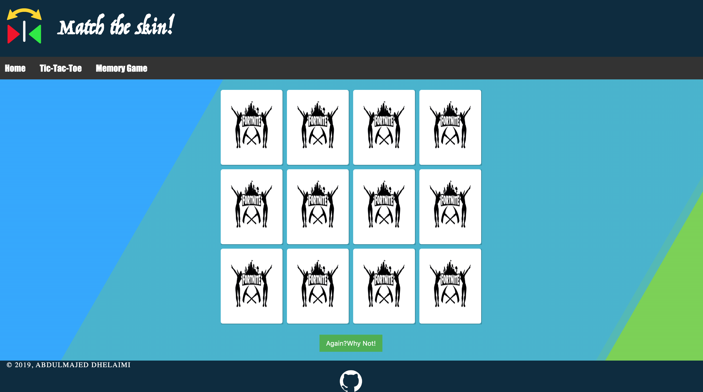
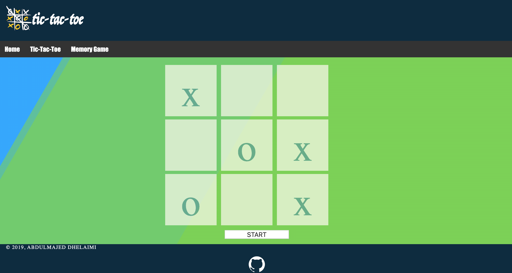

# Home of Fun

A web application that has games

## Description

The web application has a tic-tac-toe game + memory game

### Technical Used

HTML
CSS
JavaScript, and jQuery for DOM manipulation

### Wireframes

### User Stories of Tic-Tac-Toe
--- as a user, I want to play with others.
--- as a user, I want to know who is winning.
--- as a user, I want to be able to play more than one time.

### User Stories of Memory Game

--- as a user, I want to try more one time
--- as a user, I want to be able to reset the game
--- as a user, I want to be able to play anytime

## Planning and Development Process

--- After spending the weekend thinking about a cybersecurity related game,
I have decided to change my mind to build other kind of games.

--- I started working on the tic-tac-toe game, and I found that I still have time to build another game so I decided to build a memory game.

### Problem-Solving Strategy

My startegy to solve problems is to ask my the TA's, Insructor, my classmates and google.

### Unsolved problems

--- I didn't have the time to do more features in both of my games.
    such as: adding timer and scores.

## Acknowledgments

* I would like to thank my Instructor Mr.Erbere and my squad leader "Ahmad Yaseen"
* I also would like to thank the TA "Yasir Almuhtrish" and my calssmates
* And I won't forget to that MISK Academy and General Assembly for the opportunity to be a part of an amazing team.

---

 ## References
* www.github.com
* www.google.com
* www.youtube.com